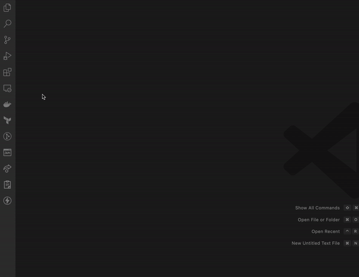

# Development

## Glossary

- [Development Container](#development-container)


## Development Container

This repository supports VSCode development containers.

### Quick Start

This tooling repository is designed to be cloned and used locally. All steps needed to quickly get up and running are listed below. This project [**requires Docker Desktop**](https://chewy.service-now.com/sh?id=search&spa=1&q=docker%20access&disableAllSuggestions=false&disableSpellCheck=false) to be setup on the host machine for this to work.

1. Setup Artifactory credentials on your host.

   This project pulls some resources from Artifactory, so the devcontainer needs certain environment variables set on the host to    work properly.
   
   On your host machine, make sure you have the following environment variables set:
   
   - `ARTIFACTORY_USER`
   - `ARTIFACTORY_PASS` || `ARTIFACTORY_TOKEN` || `ARTIFACTORY_PASSWORD`
   
   You can check this by using echo statements (i.e. `echo $ARTIFACTORY_USER`) to make sure there are values set.
   
   If you do not have these credentials setup:
   
   1. Go to Okta.
   1. Go to Artifactory.
   1. Select your user in the top right and hit `Edit Profile`.
   1. Select `Generate an Identity Token` and put in some description (not important).
   1. IMPORTANT: Copy the `Reference Token`. You will not get a second chance to grab this.
   1. Go to `~/.zshrc` (or bash equivalent) and paste in the following two lines:

      ```sh
      export ARTIFACTORY_USER={your-username}@chewy.com
      export ARTIFACTORY_PASSWORD={your-reference-token}
      ```

2. Download [Visual Studio Code](https://code.visualstudio.com/download).

3. Open VSCode and install the `Dev Containers` extension. This will allow the spinning up of docker containers and opening VSCode inside of them, thus providing pre-built easy to use development Virtual Machines. (This is the only extension required by this repo, all others will be automatically installed inside of the container.)

   

4. Clone this repository (https://github.com/Chewy-Inc/jenkins-cicd) and open it inside of VSCode.

5. Open the project inside of a dev container.

   > **WARNING**:
      When starting the devcontainer, if you get an error like:
      `docker-credential-desktop not installed or not available in PATH`
   then see [this StackOverflow Answer](https://stackoverflow.com/a/68202428/8150685)

   There are **three** possible ways to reopen the project inside of the container.

   a. A popup may appear in the bottom right like the following, if so, click it. If you missed this popup continue to the other ways to open the container.

      

   b. The small green rectangle button on the bottom most left part of the screen can be selected and then hit `"Reopen in Container"` from the drop down that appears.

      

   c. Lastly, you can do <kbd>Cmd</kbd> + <kbd>Shift</kbd> + <kbd>P</kbd>, search for `"Dev Containers: Reopen in Container"`, and select it.

   **NOTE**: the very first build of the container may take awhile, but subsequent builds should take a matter of seconds.

6. Once the build is finished and the IDE is open everything should be setup. AWS CLI, Java 21, Gradle, & Groovy should all be configured as well as bunch of handy extensions. Installed extensions can be found inside the [devcontainer.json file](./../.devcontainer/devcontainer.json)