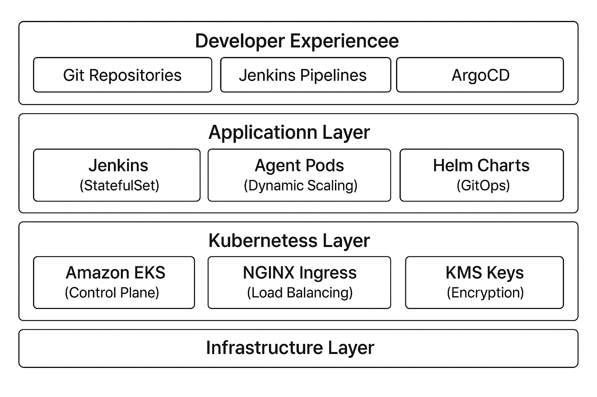

# Jenkins on EKS - Complete Infrastructure Project Overview

## Project Summary

This repository provides a **Jenkins CI/CD platform** running on Amazon EKS (Elastic Kubernetes Service). It combines Infrastructure as Code (Terraform), Kubernetes orchestration (Helm), and comprehensive automation to deliver a scalable, secure, and maintainable CI/CD solution.

##  Architecture
### Technology Stack

##  Detailed Project Structure

### Infrastructure Layer (`terraform/`)
**Purpose**: Provision and manage all AWS resources required for Jenkins operation

**Key Components:**
- **`efs.tf`** : Amazon EFS file system, mount targets, and access points
- **`iamrole.tf`** : IAM roles for Jenkins ECR access and EFS CSI driver operations
- **`secrets.tf`** : AWS Secrets Manager integration with SOPS encryption
- **`efs_csi_irsa.tf`**: IRSA configuration for EFS CSI driver
- **`environments/dev.tfvars`**: Environment-specific variable configurations

**Features:**
- Multi-environment support (dev/staging/prod)
- KMS-encrypted EFS storage with configurable access points
- IRSA (IAM Roles for Service Accounts) for secure AWS access
- SOPS-encrypted secrets management

### Kubernetes Layer (`helm/`)
**Purpose**: Deploy and configure Jenkins and supporting services on EKS

#### Jenkins Deployment (`helm/jenkins-eks/`)
- **`values.yaml`**: Complete Jenkins configuration including:
  - Controller and agent pod configurations
  - Plugin management and JCasC (Jenkins Configuration as Code)
  - Service accounts with IRSA annotations
  - Ingress and networking setup
  - External secrets integration
  - Multi-agent pod templates (Java, Node.js, Python, Docker)

#### EFS CSI Driver (`helm/aws-efs-csi-driver/`)
- **`values.yaml`** (7.3KB): CSI driver configuration for EFS integration
- **Templates**: Kubernetes manifests for controller/node daemonsets

**Features:**
- Dynamic agent scaling with custom Docker images
- Persistent storage via Amazon EFS
- External secrets synchronization
- Ingress and networking setup

### 🔄 CI/CD Layer (`jenkins/`)
**Purpose**: Jenkins pipeline definitions and CI/CD automation

- **`ci/Jenkinsfile`**: Comprehensive CI pipeline including:
  - Multi-stage build processes
  - Artifact management
- **`deploy/Jenkinsfile`**: Deployment pipeline for:
  - Infrastructure updates
  - Application deployments
  - Environment configuration

**Features:**
- Self-deploying Jenkins infrastructure
- Integrated CI/CD workflows
- Multi-environment deployment strategies
- ArgoCD synchronization