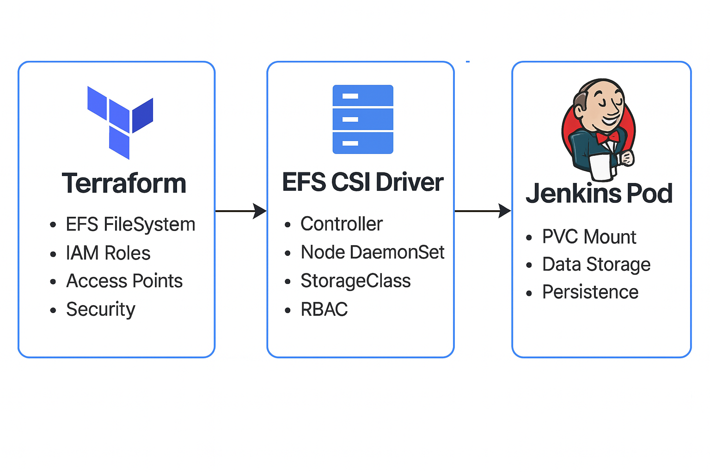

# AWS EFS CSI Driver Setup with Terraform Integration

This document provides a comprehensive guide for setting up the AWS EFS CSI Driver using Helm, integrated with Terraform-managed EFS infrastructure.

---

## Table of Contents

* [Overview](#overview)
* [Prerequisites](#prerequisites)
* [Terraform Infrastructure Setup](#terraform-infrastructure-setup)
* [EFS CSI Driver Deployment](#efs-csi-driver-deployment)
* [Reference](#reference)

---

## Overview

### Architecture: Components Integration

| Component        | Terraform Creates              | Helm Deploys             | Usage                             |
| ---------------- | ------------------------------ | ------------------------ | --------------------------------- |
| EFS File System  | ✅ File system, mount targets   | -                        | Persistent storage backend        |
| IAM Roles        | ✅ CSI driver permissions       | -                        | AWS API access for CSI operations |
| Access Points    | ✅ Pre-configured access points | -                        | Controlled access to EFS          |
| CSI Driver       | -                              | ✅ Controller & node pods | Kubernetes storage interface      |
| Storage Classes  | -                              | ✅ Dynamic provisioning   | PVC provisioning rules            |
| Service Accounts | -                              | ✅ IRSA-enabled accounts  | Secure AWS access from pods       |

---

## Prerequisites

### Required Tools

```bash
# Verify required tools
terraform --version    # >= 1.0
helm version           # >= 3.0
kubectl version        # >= 1.21
aws --version          # >= 2.0
```

### AWS Permissions

Ensure your AWS credentials have permissions for:

* EFS management
* IAM role management
* EC2 VPC operations
* EKS cluster access

### Existing Infrastructure

* **EKS Cluster**: Running cluster with OIDC provider
* **VPC and Subnets**: For EFS mount targets
* **Security Groups**: EKS node security groups for EFS access

---

## Terraform Infrastructure Setup

Provision EFS, IAM roles, access points, and security groups using Terraform. Ensure outputs are available for Helm chart input (e.g., `EFS_FILE_SYSTEM_ID`, `EFS_ACCESS_POINT_ID`, `CSI_DRIVER_ROLE_ARN`).

---

## EFS CSI Driver Deployment

### 1. Update Helm Values

Create or update your Helm values file:

```yaml
# ========================================
# EFS CSI DRIVER CONTROLLER CONFIGURATION
# ========================================
controller:
  replicaCount: 2
  logLevel: 2
  serviceAccount:
    create: true
    name: efs-csi-controller-sa
    annotations:
      eks.amazonaws.com/role-arn: ${CSI_DRIVER_ROLE_ARN}
  resources:
    limits:
      cpu: 100m
      memory: 128Mi
    requests:
      cpu: 50m
      memory: 64Mi

# ========================================
# EFS CSI DRIVER NODE CONFIGURATION
# ========================================
node:
  logLevel: 2
  serviceAccount:
    create: true
    name: efs-csi-node-sa
    annotations:
      eks.amazonaws.com/role-arn: ${CSI_DRIVER_ROLE_ARN}
  resources:
    limits:
      cpu: 100m
      memory: 128Mi
    requests:
      cpu: 50m
      memory: 64Mi

# ========================================
# STORAGE CLASS DEFINITIONS
# ========================================
storageClasses:
  - name: efs-sc
    annotations:
      storageclass.kubernetes.io/is-default-class: "false"
    mountOptions:
      - tls
      - _netdev
    parameters:
      provisioningMode: efs-ap
      fileSystemId: ${EFS_FILE_SYSTEM_ID}
      directoryPerms: "700"
      basePath: "/jenkins"
    reclaimPolicy: Retain
    volumeBindingMode: Immediate

# ========================================
# EFS CSI DRIVER IMAGE CONFIGURATION
# ========================================
image:
  repository: public.ecr.aws/efs-csi-driver/amazon/aws-efs-csi-driver
  tag: "v2.1.9"
  pullPolicy: IfNotPresent

# ========================================
# HELM HOOKS FOR CSI DRIVER INSTALLATION
# ========================================
useHelmHooksForCSIDriver: true
```

### 2. Deploy EFS CSI Driver

Deployment is automated through the CI/CD pipeline. Key steps:

#### Versioning the Helm Chart

The chart is versioned according to semantic release standards before packaging.

#### Packaging the Helm Chart

The chart is bundled into a `.tgz` archive for publishing.

#### Publishing to JFrog Artifactory

The packaged chart is uploaded to:

```
https://chewyinc.jfrog.io/artifactory/chewy-helm-dev-virtual
```

#### Argo CD Sync

Argo CD monitors the repository, detects changes, and automatically syncs the latest chart to the target Kubernetes cluster.

### 3. Verify Deployment

Argo CD will display pod and sync status, allowing users to monitor deployment.

---

## Reference

For advanced configurations and troubleshooting, refer to the [official AWS EFS CSI Driver GitHub repository](https://github.com/kubernetes-sigs/aws-efs-csi-driver).
