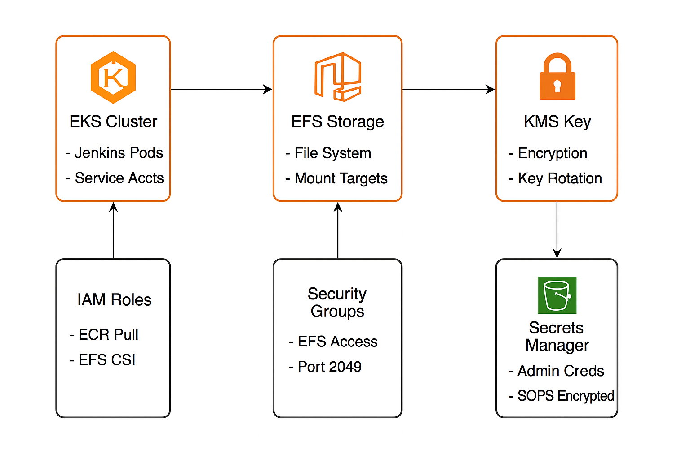

# Jenkins on EKS - Terraform Infrastructure Guide

This document provides comprehensive guidance for setting up, deploying, and managing the Terraform infrastructure for Jenkins on EKS, including EFS storage, IAM roles, and secrets management.

---

## Table of Contents

* [Infrastructure Overview](#infrastructure-overview)
* [Prerequisites](#prerequisites)
* [Initial Setup](#initial-setup)
* [Deployment Process](#deployment-process)
* [Update Procedures](#update-procedures)
* [Environment Management](#environment-management)
* [Resource Reference](#resource-reference)

---

## Infrastructure Overview

### Components Managed

* **EFS File System:** Encrypted persistent storage for Jenkins data
* **KMS Key:** Encryption key for EFS file system
* **IAM Roles:**

  * Jenkins ECR pull role for container image access
  * EFS CSI driver role for storage management
* **Security Groups:** Network access control for EFS
* **AWS Secrets Manager:** Encrypted secrets storage with SOPS integration
* **Access Points:** EFS access points for Jenkins workspaces

---

### Architecture

---
## Prerequisites

### Required Tools

```bash
# Terraform
terraform --version  # >= 1.0

# AWS CLI
aws --version        # >= 2.0

# SOPS for secrets management
sops --version       # >= 3.7

# kubectl for Kubernetes access
kubectl version      # >= 1.21
```

### AWS Permissions

Your AWS credentials must have permissions for `management_dev`:

* [EFS](https://us-east-1.console.aws.amazon.com/efs/home?region=us-east-1#/file-systems/fs-0c81a767f7647d219) management (CreateFileSystem, CreateMountTarget, etc.)
* IAM role and policy management
* KMS key management (e.g., [`sops-master`](https://us-east-1.console.aws.amazon.com/efs/home?region=us-east-1#/file-systems/fs-0c81a767f7647d219), [`jenkins-eks-key`](https://us-east-1.console.aws.amazon.com/efs/home?region=us-east-1#/file-systems/fs-0c81a767f7647d219))
* [Secrets Manager access](https://us-east-1.console.aws.amazon.com/efs/home?region=us-east-1#/file-systems/fs-0c81a767f7647d219)

### Required AWS Resources

Before deployment, ensure these resources exist:

* **[EKS Cluster](https://us-east-1.console.aws.amazon.com/efs/home?region=us-east-1#/file-systems/fs-0c81a767f7647d219)**: Running EKS cluster with OIDC provider
* **VPC:** Target VPC for EFS deployment
* **Private Subnets:** For EFS mount targets
* **Security Groups:** EKS node security groups for EFS access

---

## Initial Setup

### 1. Environment Configuration

```bash
cp environments/dev.tfvars environments/prod.tfvars
```

### 2. Backend Configuration

In `providers.tf`:

```hcl
backend "s3" {
  bucket = "shd-use1-apps-terraform"
  key    = "plat/jenkins-eks/terraform.tfstate"
  region = "us-east-1"
  acl    = "bucket-owner-full-control"
}
```

### 3. SOPS Setup for Secrets

Refer to the [SOPS Implementation Guide](https://chewyinc.atlassian.net/wiki/spaces/CND/pages/2355366466/SOPS+Implementation+Guide).

---

## Deployment Process

Deployment is orchestrated through a Jenkins CI/CD pipeline. You can review the pipeline configuration and execution steps in the `jenkins/` [folder](https://us-east-1.console.aws.amazon.com/efs/home?region=us-east-1#/file-systems/fs-0c81a767f7647d219).

---

## Update Procedures

### 1. Secrets Updates

```bash
cd terraform
touch secret.json
echo "secret.json" >> .gitignore
```

**Edit `secret.json`:**

```json
{
  "username": "username",
  "password": "password",
  "GitHub Access Token": "123123131313133",
  "Github Plugin WebHook": "123131313131",
  "JFrog Access Token": "123131313",
  "hliu1 Jfrog Access Token": "123123131313"
}
```

**Encrypt with SOPS:**

```bash
sops --encrypt --kms <aws-arn-key> secret.json > secret.enc.json
```

### 2. Environment Variable Updates

```bash
vim environments/dev.tfvars
```

Example:

```hcl
kms_key_id = "arn:aws:kms:us-east-1:590183723998:key/new-key-id"
```

### 3. EFS Configuration Updates

Resize EFS (no downtime):

```hcl
throughput_mode = "elastic"  # or "provisioned"
terraform apply -var-file="environments/dev.tfvars"
```

**Add New Access Points:**

```hcl
access_points = {
  "jenkins" = {
    posix_user = {
      uid = "1001"
      gid = "1001"
    }
    creation_info = {
      uid         = "1001"
      gid         = "1001"
      permissions = "0755"
    }
  }
  "jenkins-builds" = {
    posix_user = {
      uid = "1002"
      gid = "1002"
    }
    creation_info = {
      uid         = "1002"
      gid         = "1002"
      permissions = "0755"
    }
  }
}
```

### 4. IAM Role Updates

Update ECR Repository Access:

```hcl
Resource = [
  "arn:aws:ecr:us-east-1:278833423079:repository/*",
  "arn:aws:ecr:us-east-1:278833423079:repository/new-repo/*"
]
```

Update OIDC Provider:

```hcl
cluster_oidc_provider_arn = "arn:aws:iam::590183723998:oidc-provider/oidc.eks.us-east-1.amazonaws.com/id/NEW-ID"
cluster_oidc_provider_url = "oidc.eks.us-east-1.amazonaws.com/id/NEW-ID"
```

---

## Environment Management

### Environment Structure

```
terraform/
├── environments/
│   ├── dev.tfvars      # Development environment
│   ├── staging.tfvars  # Staging environment
│   └── prod.tfvars     # Production environment
```

### Security Group Updates

```hcl
eks_node_security_group_ids = [
  "sg-0af25bde31103ef69",
  "sg-0ab855684fcd892f5",
  "sg-new-node-group-id"
]
```

---

## Created Resources

### EFS (Elastic File System)

* **File System:** `jenkins-efs` - scalable, multi-AZ shared storage
* **Mount Targets:** One per private subnet
* **Access Points:** Configured via `access_points` variable
* **Security Group:** `efs-sg`, allowing NFS (port 2049) from EKS nodes

### IAM Resources

* `jenkins-eks-ecr-pull-role`: For agent access to ECR
* `AmazonEKS_EFS_CSI_DriverRole`: For EFS CSI driver
* `jenkins-ecr-pull-policy`, `EKS_EFS_CSI_Driver_Policy`

### KMS Resources

* `jenkins-efs-kms`: Encryption key for EFS
* Permissions assigned per service

### Secrets Manager

* `admin-credentials`: Jenkins admin login
* JFrog token, GitHub token, webhook secret
* SOPS-encrypted, backed by AWS KMS

---

## Variable Reference

| Variable                      | Description                         | Default                                     | Required |
| ----------------------------- | ----------------------------------- | ------------------------------------------- | -------- |
| `environment`                 | Environment name (dev/staging/prod) | -                                           | Yes      |
| `region`                      | AWS region                          | -                                           | Yes      |
| `vpc_id`                      | VPC ID for resources                | -                                           | Yes      |
| `eks_node_security_group_ids` | EKS node security groups            | -                                           | Yes      |
| `private_subnet_ids`          | Subnets for mount targets           | -                                           | Yes      |
| `encrypted`                   | Enable EFS encryption               | -                                           | Yes      |
| `kms_key_id`                  | KMS key for EFS                     | -                                           | Yes      |
| `access_points`               | EFS access point config             | -                                           | Yes      |
| `cluster_oidc_provider_arn`   | EKS OIDC provider ARN               | -                                           | Yes      |
| `cluster_oidc_provider_url`   | EKS OIDC provider URL               | -                                           | Yes      |
| `app_name`                    | Application name                    | jenkins-eks                                 | No       |
| `cost_center`                 | Cost center tag                     | plat                                        | No       |
| `owner_email`                 | Owner tag                           | [releng@chewy.com](mailto:releng@chewy.com) | No       |
